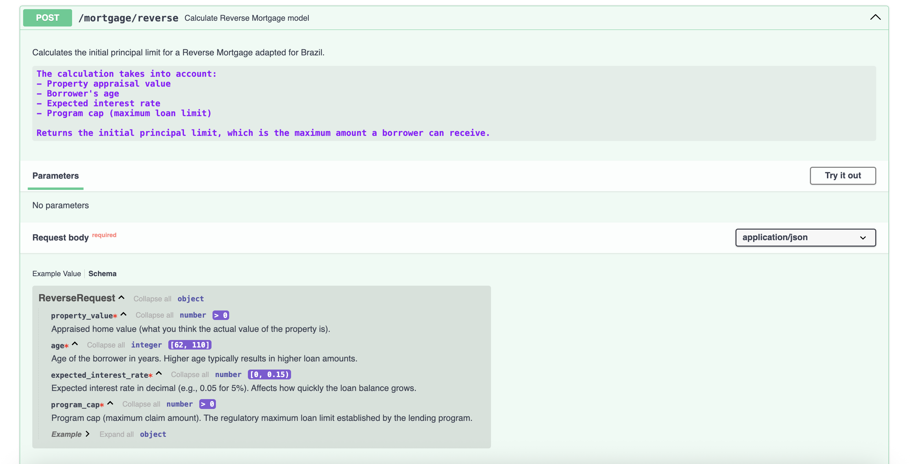

# Reverse Mortgage Calculator API

A FastAPI backend for calculating reverse mortgage and viager estimates, with PDF document analysis capabilities using Anthropic's Citation API.

## Setup

1. Install Python 3.11 (or higher)

2. Create a virtual environment (optional but recommended):
   ```bash
   python -m venv .venv
   source .venv/bin/activate  # On Windows: .venv\Scripts\activate
   ```

3. Install dependencies:
   ```bash
   pip install -r requirements.txt
   ```

4. Configure environment variables (for PDF analysis):
   ```bash
   # Create a .env file or set environment variables
   export ANTHROPIC_API_KEY=your_anthropic_api_key_here
   ```

   Get your Anthropic API key from: https://console.anthropic.com/

## Running the API

To run the API, first make sure you are in the backend folder and then run:

```bash
python run.py
```

or using fastapi dev (recommended):

```bash
fastapi dev src/main.py
```


The API will be available at http://localhost:8000

## API Documentation

FastAPI automatically generates interactive API documentation:

- Swagger UI: http://localhost:8000/docs
- ReDoc: http://localhost:8000/redoc




## API Endpoints

### Viager (French Life Annuity) Model

- `POST /mortgage/viager`: Calculate the annual annuity for a viager contract

#### Request Body

```json
{
  "property_value": 1000000,
  "annual_rent": 36000,
  "age": 70,
  "discount_rate": 0.05,
  "upfront_payment": 0.2
}
```

#### Response

```json
{
  "annual_annuity": 27500.0
}
```

### Reverse Mortgage Model

- `POST /mortgage/reverse`: Calculate the initial principal limit for a reverse mortgage

#### Request Body

```json
{
  "property_value": 1000000,
  "age": 70,
  "expected_interest_rate": 0.04,
  "program_cap": 1200000
}
```

#### Response

```json
{
  "initial_principal_limit": 500000.0
}
```

### PDF Analysis Endpoints

#### Upload and Analyze PDF

- `POST /pdf/analyze-upload`: Upload a PDF file and analyze it with Anthropic's Citation API

**Request**: Multipart form data
- `file`: PDF file to upload
- `query`: Question or instruction for analyzing the PDF
- `document_title` (optional): Title for the document
- `context` (optional): Additional context about the document
- `max_tokens` (optional): Maximum tokens in response (default: 1024)

**Response**:
```json
{
  "content": "Analysis result from Claude",
  "citations": [
    {
      "type": "page_location",
      "cited_text": "The exact text being cited",
      "document_index": 0,
      "document_title": "Document Title",
      "start_page_number": 1,
      "end_page_number": 2
    }
  ],
  "model_used": "claude-3-5-sonnet-20241022",
  "usage": {
    "input_tokens": 1500,
    "output_tokens": 300
  }
}
```

#### Analyze PDF from URL

- `POST /pdf/analyze-url`: Analyze a PDF document from a URL

**Request Body**:
```json
{
  "pdf_url": "https://example.com/document.pdf",
  "request": {
    "query": "What are the key findings in this document?",
    "document_title": "Property Registration",
    "context": "This is a Property Registration document for analysis",
    "max_tokens": 1024
  }
}
```

#### Health Check

- `GET /pdf/health`: Check if the PDF analysis service is properly configured

## Model Formulas

### Viager Model

The Viager model calculates the annual payment for a property based on:

1. Calculate annuity factor using mortality tables and discount rate
2. Calculate occupied value: `V_occ = V - (rent * a_x(δ))`
3. Calculate annual annuity: `R = (V_occ * (1 - p)) / a_x(δ)`

Where:
- `V` = Property value
- `rent` = Annual rental value
- `a_x(δ)` = Annuity factor based on age and discount rate
- `p` = Upfront payment fraction
- `R` = Annual annuity (result)

### Reverse Mortgage Model

The Reverse Mortgage model calculates the initial principal limit:

`PL = min(V, L_max) * PLF(x, EIR)`

Where:
- `V` = Property value
- `L_max` = Program cap
- `PLF` = Principal Limit Factor based on age and expected interest rate
- `PL` = Initial principal limit (result)

Note: The calculations use simplified implementations of mortality tables and PLF tables. In a production environment, these would be replaced with actual data from IBGE (Brazilian Institute of Geography and Statistics) and financial institutions.

# Reverse Mortgage and Viager Property Models API

This API provides structured request and response models for calculating financial estimates in **reverse mortgage** and **viager-style property transactions**. It is intended for use in platforms that assist with property-based financial solutions for elderly homeowners.

The models are implemented using Pydantic and support validation and documentation for each parameter used in the calculations.

---

## Use of Anthropic Citations API

The **Anthropic Citations API** can be integrated into this system to improve the **analysis of property documents**. This is particularly relevant in scenarios involving legal, financial, or regulatory documents where AI-generated outputs require transparency and traceability.

### Why Use Citations in Property Analysis

When analyzing complex property contracts and legal clauses, the Citations API provides:

* Traceability: Shows the source of each AI-generated insight
* Justification: Links statements to specific excerpts in uploaded documents
* Compliance: Supports explanations for decisions made based on legal texts

For example, if the system extracts usufruct rights, age clauses, or property encumbrances from a deed, the Citations API allows those extractions to be backed by a reference to the original document.

This is essential for:

* Ensuring legal consistency
* Building user trust in AI-powered decisions
* Supporting financial institutions in meeting documentation standards


